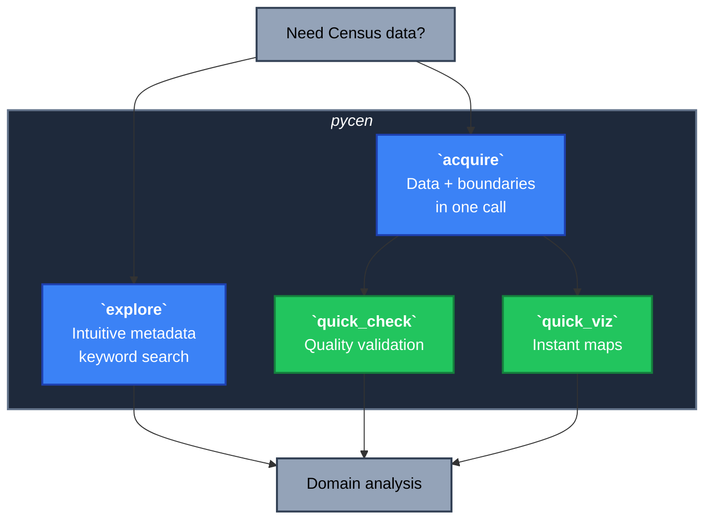

# pycen

Lightweight Python package for exploring and acquiring U.S. Census data with intuitive spatial integration. <br><br>



## Installation

```bash
# first-time install, or fresh environment
pip install --pre pycen  # pre-release version

# specify a particular version
pip install pycen==0.1.0a4
```

## Tutorials
1. `0_config.ipynb` - Setup and configuration
2. `1_explore.ipynb` - Exploring datasets
3. `2_acquire_spatial.ipynb` - Spatial data basics
4. `3_acquire_tabular.ipynb` - Tabular data
5. `4_acquire_spatial-advanced.ipynb` - Advanced spatial operations

## Notes
- Python 3.10+
- optional: U.S. Census API key: https://api.census.gov/data/key_signup.html
- PyPI: https://pypi.org/project/pycen/
