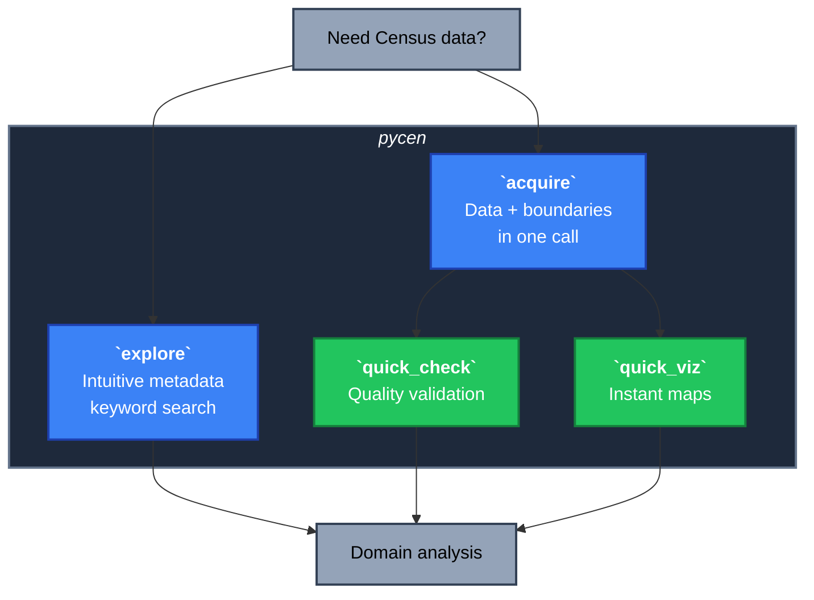

# pycen

Lightweight Python package for exploring and acquiring U.S. Census data with intuitive spatial integration. <br><br>


```mermaid
flowchart TD
    A[Need Census data?]

    A --> B & C

    subgraph PYCEN["<i>pycen</i>"]
        direction TB
        B[<b>`explore`</b><br/>Intuitive metadata<br/>keyword search]
        C[<b>`acquire`</b><br/>Data + boundaries<br/>in one call]

        C --> D
        C --> E

        D[<b>`quick_check`</b><br/>Quality validation]
        E[<b>`quick_viz`</b><br/>Instant maps]
    end

    B --> F
    D & E --> F[Domain analysis]

    style A fill:#94a3b8,stroke:#334155,stroke-width:2px,color:#000
    style B fill:#3b82f6,stroke:#1e40af,stroke-width:2px,color:#fff
    style C fill:#3b82f6,stroke:#1e40af,stroke-width:2px,color:#fff
    style D fill:#22c55e,stroke:#15803d,stroke-width:2px,color:#fff
    style E fill:#22c55e,stroke:#15803d,stroke-width:2px,color:#fff
    style F fill:#94a3b8,stroke:#334155,stroke-width:2px,color:#000
    style PYCEN fill:#1e293b,stroke:#64748b,stroke-width:2px,color:#fff
```

## Installation

```bash
pip install pycen           # Python 3.10+
pip install -U pycen        # upgrade an existing install
pip install pycen==0.1.0a5  # specify a particular version
```

## Tutorials
1. `0_config.ipynb` - Setup and configuration
2. `1_explore.ipynb` - Exploring datasets
3. `2_acquire_spatial.ipynb` - Spatial data basics
4. `3_acquire_tabular.ipynb` - Tabular data
5. `4_acquire_spatial-advanced.ipynb` - Advanced spatial operations

## Notes
- Python 3.10+
- U.S. Census API key (required): https://www.census.gov/data/developers.html
- PyPI: https://pypi.org/project/pycen/
